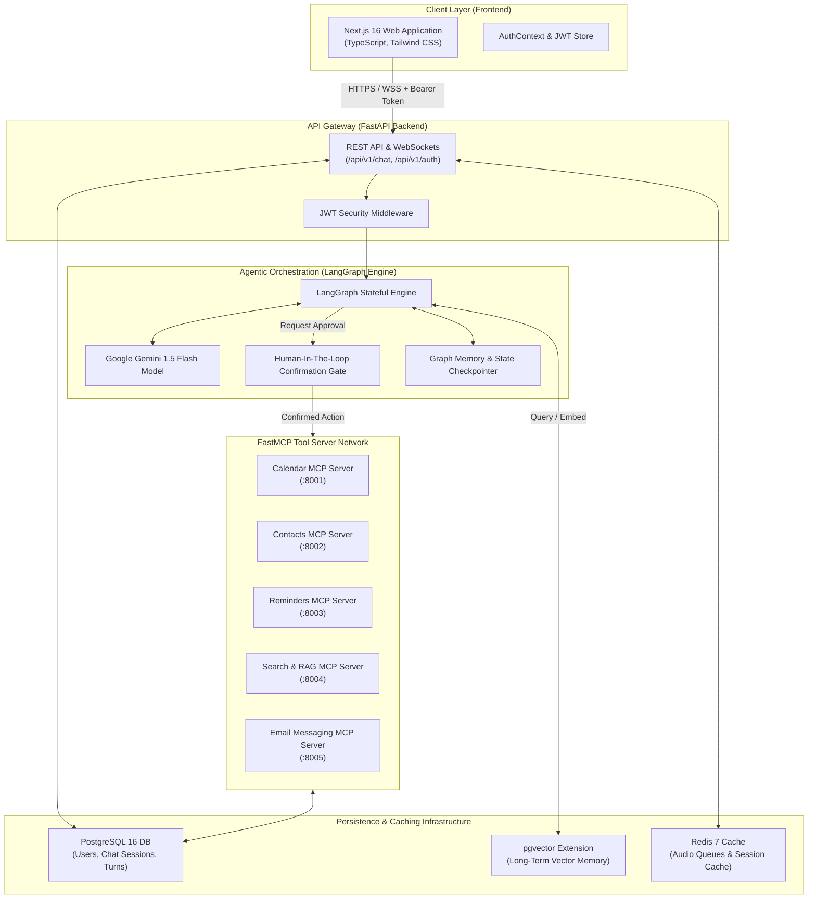

# 💬 Alex — Enterprise Chat-Driven AI Assistant Agent Platform

[](https://github.com/mr-rajesh857/alex-voice-agent/actions/workflows/ci-cd.yml)
[](https://nextjs.org/)
[](https://fastapi.tiangolo.com/)
[](https://python.langchain.com/)
[](https://github.com/pgvector/pgvector)
[](https://modelcontextprotocol.io/)

> **Architectural Specification & Production Engineering Guide**  
> *Authored from an SDE-3 (Senior Staff Software Engineer) perspective for high-availability AI agent systems.*

---

## 📋 Executive Overview


**Alex** is a production-grade, enterprise-ready chat-driven AI assistant platform designed to automate productivity workflows, schedule management, document search, and personal/enterprise communications.

Built upon a **stateful agentic graph architecture (LangGraph)**, Alex bridges large language models (Google Gemini) with modular tools through the **Model Context Protocol (FastMCP)**. The system includes **Human-in-the-Loop (HITL) security gates** for high-risk action confirmation, persistent semantic vector memory via **PostgreSQL `pgvector`**, and an automated **GitHub Actions CI/CD pipeline** delivering continuous deployment to **Vercel**.

---

## 🏗️ System Architecture & Data Flow



---

## ⚙️ Core Subsystem Breakdown

### 1. Frontend Web Application (`/frontend`)
* **Framework**: Next.js 16 (App Router, Turbopack, TypeScript, Tailwind CSS).
* **State & Authentication**: Context-driven authentication provider (`AuthContext`) managing JWT lifecycle and persistent session state.
* **User Interface**: Glassmorphic theme featuring live transcript displays, prompt recommendations, tool status indicators, and confirmation dialogs for pending actions.
* **API Client**: Modular HTTP/WebSocket client ([frontend/src/lib/api.ts](file:///home/rajeshkumarpanda/Documents/Alex/frontend/src/lib/api.ts)) with automatic Bearer token injection.

### 2. FastAPI Gateway & Security (`/backend/app`)
* **API Engine**: Async FastAPI 0.110+ running under Uvicorn with Pydantic v2 data validation schemas.
* **Security & Auth**: OAuth2 password flow with JWT signature verification (`python-jose`) and bcrypt password hashing (`passlib`).
* **Database Access**: Async SQLAlchemy 2.0 ORM sessions connected to PostgreSQL via `asyncpg`.

### 3. Agentic Orchestrator & LangGraph Engine (`/backend/app/graph`)
* **Stateful Graph**: LangGraph state machine handling turn routing, intent recognition, memory retrieval, and tool execution.
* **Human-in-the-Loop (HITL)**: Action security gates intercept sensitive tool invocations (e.g., meeting cancellations, email dispatches), requiring explicit user confirmation before execution.
* **Checkpointer**: State snapshotting allowing seamless turn resumption across HTTP requests.

### 4. FastMCP Tool Microservices (`/mcp-servers`)
Independent Model Context Protocol (MCP) microservices offering standardized tool interfaces:
* 📅 `calendar-mcp`: Meeting scheduling, availability checking, and agenda queries.
* 👤 `contacts-mcp`: Contact lookup and directory management.
* ⏰ `reminders-mcp`: Task reminder creation and listing.
* 🔍 `search-rag-mcp`: Semantic vector document search over personal notes/knowledge.
* ✉️ `email-messaging-mcp`: Email composition and inbox dispatch.

### 5. Vector Memory & Storage (`/infra/postgres`)
* **Database**: PostgreSQL 16 initialized with the `pgvector` extension ([infra/postgres/init.sql](file:///home/rajeshkumarpanda/Documents/Alex/infra/postgres/init.sql)).
* **Semantic Embeddings**: `langchain-google-genai` vector embeddings stored in HNSW / IVFFlat indexes for real-time similarity search.


## 📁 Repository Directory Layout

```
alex-voice-agent/
├── .github/
│   └── workflows/
│       └── ci-cd.yml                 # GitHub Actions CI/CD Pipeline Definition
│
├── backend/                          # FastAPI Backend Gateway & LangGraph Agent
│   ├── app/
│   │   ├── core/                     # JWT security, password hashing, environment config
│   │   ├── db/                       # Async SQLAlchemy models and session provider
│   │   ├── graph/                    # LangGraph nodes, state schema, HITL security gates
│   │   ├── llm/                      # Gemini LLM client wrappers & system prompts
│   │   ├── memory/                   # pgvector vector store retriever
│   │   ├── mcp_client/               # FastMCP tool client callers
│   │   ├── routers/                  # REST API endpoints (/auth, /chat)
│   │   └── main.py                   # FastAPI Application Entrypoint & Lifespan
│   ├── tests/
│   │   ├── conftest.py               # Global Pytest fixtures & database mocks
│   │   └── test_health.py            # API Health Check Endpoint Unit Tests
│   ├── requirements.txt              # Backend Dependencies
│   └── .env.example                  # Backend Environment Template
│
├── frontend/                         # Next.js 16 Web Application
│   ├── src/
│   │   ├── app/                      # App Router (/login, /register, / dashboard)
│   │   ├── components/               # Chat UI, status badges, prompt cards
│   │   ├── context/                  # AuthContext Provider
│   │   └── lib/                      # Centralized API HTTP Client (api.ts)
│   ├── next.config.ts                # Next.js 16 Turbopack Configuration
│   ├── package.json                  # Frontend Scripts & Dependencies
│   └── vercel.json                   # Vercel Deployment Specification
│
├── mcp-servers/                      # FastMCP Microservice Tools
│   ├── calendar-mcp/
│   ├── contacts-mcp/
│   ├── reminders-mcp/
│   ├── search-rag-mcp/
│   ├── email-messaging-mcp/
│   └── user-prefs-mcp/
│
├── infra/                            # Infrastructure Provisioning
│   └── postgres/init.sql             # PostgreSQL schema & pgvector extension init
│
├── docker-compose.yml                # Containerized Database & Redis Services
├── .gitignore                        # Global Git Ignore Rules
└── README.md                         # Production Engineering Specification
```

---

## ⚡ Quick Start Guide (Local Execution)

### System Prerequisites
* **Docker** & Docker Compose (v2.0+)
* **Python** 3.11+
* **Node.js** 20+ & npm

---

### Step 1: Clone Repository & Setup Environment

```bash
git clone git@github.com:mr-rajesh857/alex-voice-agent.git
cd alex-voice-agent

# Create environment configuration
cp .env.example .env
cp backend/.env.example backend/.env
```

Set your Google Gemini API key in `backend/.env`:
```env
GEMINI_API_KEY=your_actual_gemini_api_key_here
JWT_SECRET=your_32_byte_secure_random_jwt_secret
ENCRYPTION_KEY=your_32_byte_secure_encryption_key
```

---

### Step 2: Launch Infrastructure (PostgreSQL + pgvector & Redis)

```bash
docker compose up -d
```
* **PostgreSQL Database**: `localhost:5433`
* **Adminer Web GUI**: [http://localhost:8080](http://localhost:8080)
* **Redis Cache**: `localhost:6379`

---

### Step 3: Run Backend API Server

```bash
cd backend
source ../.venv/bin/activate
pip install -r requirements.txt
uvicorn app.main:app --reload --port 8000
```
* **API Server**: [http://localhost:8000](http://localhost:8000)
* **Interactive OpenAPI Specs (Swagger)**: [http://localhost:8000/api/v1/docs](http://localhost:8000/api/v1/docs)

---

### Step 4: Run Frontend Development Server

In a new terminal window:
```bash
cd frontend
npm install --legacy-peer-deps
npm run dev
```
* **Frontend Application**: [http://localhost:3000](http://localhost:3000)

---

## 🧪 Verification & Automated Testing

Execute the test suites locally to verify application integrity:

```bash
# 1. Run Backend Pytest Suite
PYTHONPATH=backend pytest backend/tests

# 2. Run Frontend ESLint Code Analysis
cd frontend && npm run lint

# 3. Test Next.js Production Build
cd frontend && npm run build
```

---

## 🌐 Production Vercel Deployment Setup

To enable automated CD deployment to Vercel via GitHub Actions:

1. Obtain your **Vercel Access Token** from [vercel.com/account/tokens](https://vercel.com/account/tokens).
2. Obtain your **Project ID** and **Org ID** from Vercel Project Settings.
3. Configure the following Repository Secrets in GitHub (**Settings ➔ Secrets and variables ➔ Actions**):
   * `VERCEL_TOKEN`
   * `VERCEL_ORG_ID`
   * `VERCEL_PROJECT_ID`

Once configured, pushing any commit to `master` will automatically build, test, and deploy your frontend application to Vercel.

---

## 🛡️ Security & Enterprise Compliance

* **JWT Token Security**: Access tokens signed using HS256 algorithm with configurable expiration windows.
* **Token Encryption**: Third-party tokens and credentials encrypted at rest in PostgreSQL.
* **Input Sanitization**: Pydantic models validate all incoming REST and WebSocket JSON payloads.
* **Human-in-the-Loop Gates**: High-impact agent tools require explicit confirmation before execution, preventing unintended autonomous actions.

---


